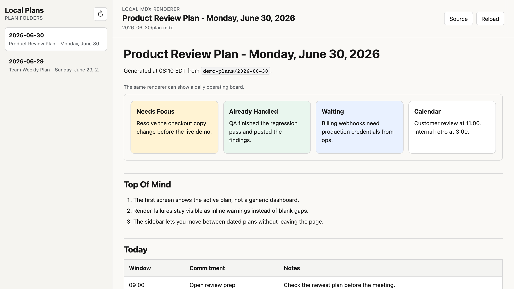

# Local Plan Viewer

Open a folder of `plan.mdx` files locally without relying on a hosted bridge.



Local Plan Viewer is a dependency-free Node microservice that turns dated MDX plan folders into a fast, readable browser view. It ships with a bundled demo so someone can clone the repo, run one command, and see the real UI immediately.

## Why it exists

- Hosted local-plan bridges can break on browser private-network rules.
- Raw MDX files are awkward to browse when you just want today's plan.
- A local viewer is easier to keep running than a heavier app stack.

## What it supports

- Folder-based plans like `plans/2026-06-30/plan.mdx`
- Headings, paragraphs, ordered and unordered lists
- Inline code and links
- `Diagram` blocks with HTML/CSS payloads
- `Table` blocks
- `Checklist` blocks
- Inline warning blocks when a component cannot be parsed cleanly

## Quick start

Prerequisite: Node.js 22+

```bash
npm start
```

Then open [http://127.0.0.1:8796/plan/latest](http://127.0.0.1:8796/plan/latest).

By default the app serves the bundled `demo-plans/` folder. Point it at your own plan directory with either of these:

```bash
PLAN_VIEWER_ROOT=/path/to/plans npm start
```

```bash
node ./bin/local-plan-viewer.js --root /path/to/plans --port 8796
```

## API

- `GET /api/health` returns `{ ok, root }`
- `GET /api/plans` lists available plan folders, newest first
- `GET /api/plan/:slug` returns the rendered HTML and source path

## Project structure

- `bin/local-plan-viewer.js` CLI entrypoint
- `src/server.js` local HTTP server
- `src/render.js` minimal MDX block renderer
- `public/` browser UI
- `demo-plans/` sample content used for the bundled preview

## Publish notes

- The repo includes demo data only.
- The app defaults to `127.0.0.1`.
- No external services, telemetry, or package dependencies are required.
